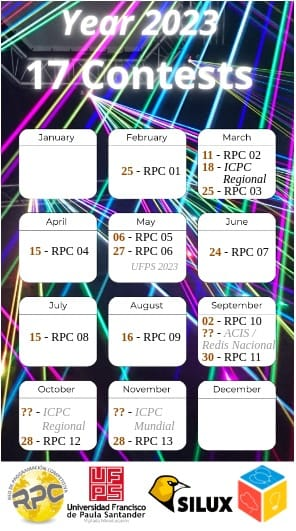

# RED DE PROGRAMACIÓN COMPETITIVA - 2023
Este repositorio contiene las diferentes pruebas realizadas durante el año de 2023 y sus soluciones 

Enlace de Inscripción: https://registro.redprogramacioncompetitiva.com/

</img>

Contests
Upcoming contests
|   Name    |   Start date  |   Registrations end date  |
|-----------|---------------|---------------------------|
| 2023 - Competencia 01 | February 25, 2023 6:00pm | February 24, 2023 8:00pm
| 2023 - Competencia 02 | March 11, 2023 1:00pm | March 10, 2023 8:00pm
| 2023 - Competencia 03 | March 25, 2023 1:00pm | March 24, 2023 8:00pm
| 2023 - Competencia 04 | April 15, 2023 1:00pm | April 14, 2023 8:00pm
| 2023 - Competencia 05 | May 6, 2023 1:00pm | May 5, 2023 8:00pm
| 2023 - Competencia 06 | May 27, 2023 1:00pm | May 26, 2023 8:00pm
| 2023 - Competencia 07 | June 24, 2023 1:00pm | June 23, 2023 8:00pm
| 2023 - Competencia 08 | July 15, 2023 1:00pm | July 14, 2023 8:00pm
| 2023 - Competencia 09 | August 12, 2023 1:00pm | August 11, 2023 8:00pm
| 2023 - Competencia 10 | September 2, 2023 1:00pm | September 1, 2023 8:00pm
| 2023 - Competencia 11 | September 30, 2023 1:00pm | September 29, 2023 8:00pm
| 2023 - Competencia 12 | October 28, 2023 1:00pm | October 27, 2023 8:00pm
| 2023 - Competencia 13 | November 25, 2023 1:00pm | November 24, 2023 8:00p